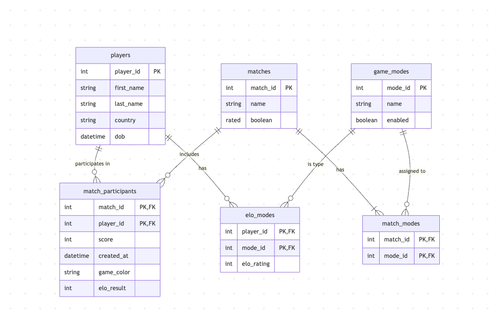

# ChessMatch Analytics Engine

**A relational database schema designed to track, analyze, and manage competitive chess match histories, player performance, and game modes.**

**Theme:** Game Telemetry

## Domain

This project is the backend database for an online chess platform. It securely stores player profiles, match configurations, and game results. It is built to quickly save match data the moment a game ends while keeping everything perfectly organized so it can be used later to improve matchmaking or study player behavior. 

The main goal is to make it easy to answer complex questions about the game. The database can efficiently:  
  - Calculate a player's win rate across different modes, like Bullet, Blitz, Rapid, Classical or Custom. 
  - Identify the most popular mode during specific hours. 
  - Pull up a perfectly accurate chronological history of matches to update Elo ratings or audit for cheating. 
  
  By organizing the data cleanly like keeping game modes in their own dedicated list and linking players to matches without duplicating data the database makes looking up statistics incredibly fast. Whether it is powering a player's profile dashboard to compare 3 minute blitz stats against 90 minute classical games, or feeding match history into a machine learning model, this foundation handles the heavy lifting effortlessly.

## Entity Relationship Diagram

