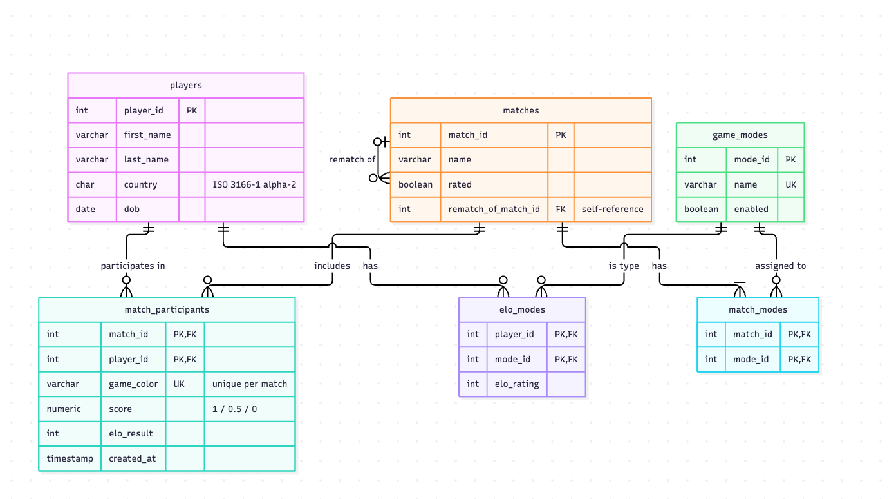

# Chess Platform Analytics Engine

**A relational database schema for tracking competitive chess matches, player performance, and game modes.**

**Theme:** Game Telemetry

## Domain

This is the backend database for an online chess platform. It stores player profiles, match settings, and game results. It is built to save a match the moment the game ends, and to keep that data organised well enough to use later for matchmaking or for studying how players behave.

The point is to make hard questions easy to answer. The database can:

- Calculate a player's win rate in each mode: Bullet, Blitz, Rapid, Classical or Custom.
- Find the most popular mode during a given hour.
- Return an exact match history in date order, to update Elo ratings or check for cheating.

Two choices make those lookups fast. Game modes live in their own list instead of being repeated as text on every match, and players are linked to matches through a junction table instead of being copied into them. Neither a profile dashboard comparing 3 minute blitz to 90 minute classical, nor a feed of match history into a machine learning model, has to scan duplicated data to get an answer.

## Entity Relationship Diagram




## Schema

One script builds the schema: [`schema/schema.sql`](schema/schema.sql), for PostgreSQL 14+. It creates six tables in dependency order.

| Table | Role | Holds |
|-------|------|-------|
| `players` | Actor | Player profiles: name, ISO country code, date of birth. |
| `game_modes` | Catalog | The list of modes (Bullet, Blitz, Rapid, Classical, Custom) and whether each is enabled. |
| `matches` | Producer | One row per game, whether it is rated, and which earlier game it is a rematch of. |
| `match_participants` | Event & Metric | One row per player per game: colour, score (1, 1/2 or 0), post game rating, timestamp. |
| `match_modes` | Junction | Which mode(s) each match was played under. |
| `elo_modes` | Junction | Each player's current rating in each mode. |

### Design decisions worth noticing

- **Composite primary keys on every junction.** `match_participants (match_id, player_id)`, `match_modes (match_id, mode_id)` and `elo_modes (player_id, mode_id)` rule out duplicates: a player appears once per match and holds one rating per mode.
- **One player per colour.** `UNIQUE (match_id, game_color)` gives a match at most one white player and one black player.
- **A recursive foreign key for rematches.** `matches.rematch_of_match_id` points at the game the rematch followed, so a full rematch series between two players can be walked with a recursive query. That walk is useful for auditing rating manipulation.
- **History is never deleted by accident.** Players and game modes use `ON DELETE RESTRICT`. A closed account is anonymised and a retired mode is set to `enabled = FALSE`, so opponents' histories and past ratings survive. Rows that only describe a match, meaning participants and mode assignments, `CASCADE` when a match is voided. Voiding an original game unlinks its rematch (`SET NULL`) instead of deleting it.
- **Chess scoring is exact.** Scores are `NUMERIC(2,1)` limited to 1, 0.5 or 0, so draws store correctly and no floating point rounding reaches a win rate calculation.
- **Every constraint is named** (`pk_`, `fk_`, `uq_`, `chk_`), so an error message says which rule was broken.

[`analysis/unit2.md`](analysis/unit2.md) gives the full reasoning for every ON DELETE choice and CHECK constraint.

### Running the script

The script does not name a schema, so its tables are created in the `public` schema of whichever database it runs against. Give it a database of its own.

Create the database:

```bash
docker exec bu603-postgres \
  psql -U bu603 -d bu603 -c 'CREATE DATABASE chess_platform;'
```

Run the script into it:

```bash
docker exec -i bu603-postgres \
  psql -U bu603 -d chess_platform -v -f < schema/schema.sql
```

The second command pipes the file in over stdin, which is what `-f -` reads. The container cannot open a host path that is not mounted into it, so the script has to arrive this way.

Without Docker, the same two steps are `createdb chess_platform` and `psql -d chess_platform -v -f schema/schema.sql`.

